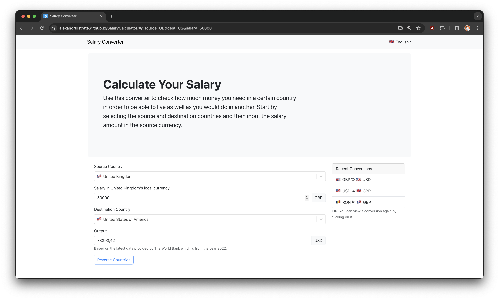

# SalaryCalculator
This is a simple app that allows the user to coonvert between the cost of living between two countries using the PPP index. Currently, it doesn't use any API data and just converts using a random number multiplier but in the future it will connect to a World Bank API to get the data.

