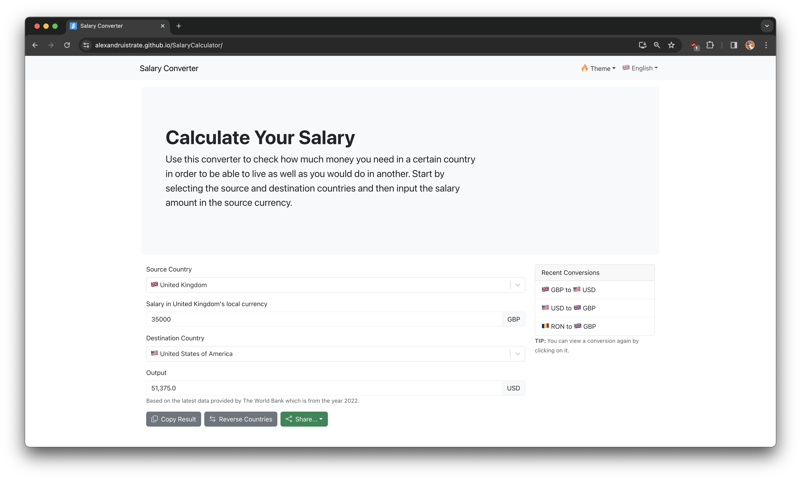

# Salary Calculator

This is a [Salary Calculator App](https://alexandruistrate.github.io/SalaryCalculator) that allows the user to convert between the cost of living between two countries using the PPP index. Currently, it doesn't use any API data and just converts using a random number multiplier but in the future it will connect to a World Bank API to get the data.

## Supported Languages
This app is currently available in the following languages:
| Language | Variant       | ISO 639-1 Code |
|----------|---------------|----------------|
| English  | International | en             |
| Spanish  | International | es             |
| Romanian | Romania       | ro             |
